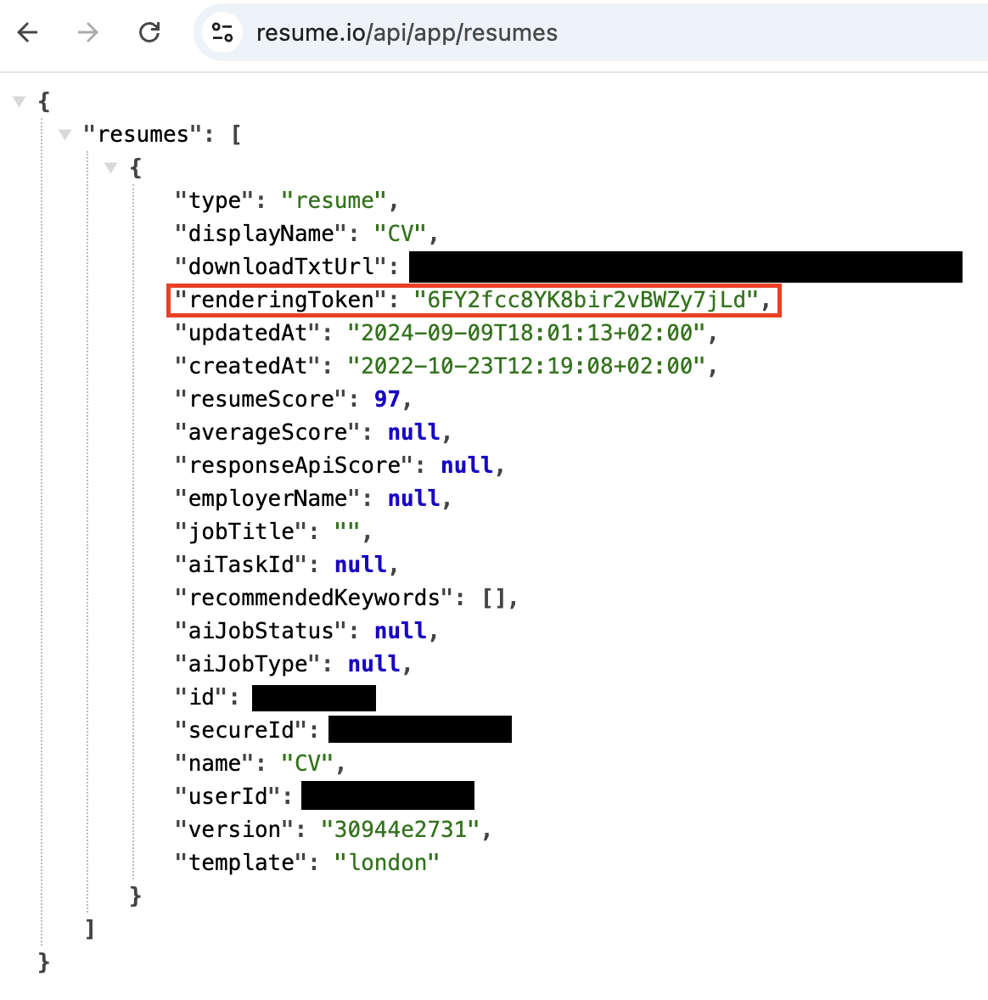

# Resume.io Downloader

Resume.io downloader run on your local for free.

#### Prerequisite
- Docker installed on your machine

#### Installation
- Clone this repo
    ```
    git clone https://github.com/dnridwn/resume.io-downloader
    ```
- Change directory to repo's directory
    ```
    cd resume.io-downloader
    ```
- Run
    ```
    docker compose up --build
    ```
    frontend service will running on http://localhost:4173 and backend service will running on http://localhost:8080

#### How to get Rendering Token
- Login to resume.io
- Open https://resume.io/api/app/resumes
- Copy rendering token
    

#### Screenshot

